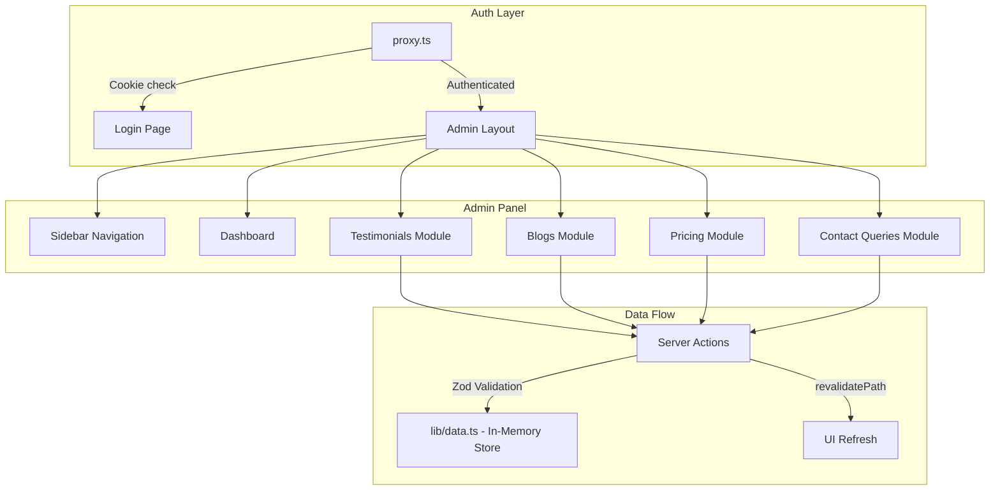

# MNS Bank Admin Panel — Implementation Plan

Build a secure, dynamic Admin Panel with 4 content-management modules, using in-memory mock data that can be swapped for a real database later.

## User Review Required

> [!IMPORTANT]
> **Auth Strategy**: Using simple hardcoded cookie-based auth (no NextAuth.js). Admin credentials are `admin@mnsbank.com` / `admin123`. This avoids heavy dependencies while still demonstrating a proper login/logout flow. If you want NextAuth.js v5 instead, let me know.

> [!IMPORTANT]
> **Rich Text Editor**: For the Blog module, I'll use a simple `<textarea>` for HTML content to avoid installing a heavy editor dependency (Tiptap/Novel). The slug auto-generates from the title. If you want a full rich text editor, specify which package.

> [!IMPORTANT]
> **Next.js 16 Breaking Change**: Middleware has been renamed to **`proxy.ts`** with an exported `proxy()` function. The plan uses this convention throughout.

> [!WARNING]
> **Tailwind CSS**: The user explicitly requests TailwindCSS + Shadcn UI. The project already has Tailwind v4 + Shadcn configured, so we'll use the existing setup.

---

## Architecture Overview



---

## Proposed Changes

### Data Layer

Core TypeScript interfaces and in-memory data store. Designed so every function signature mirrors what a real ORM call would look like.

#### [NEW] [types.ts](file:///r:/Projects/MNS%20bank/lib/types.ts)
- `Testimonial` interface: `id`, `name`, `role?`, `content`, `isActive`, `createdAt`, `updatedAt`
- `Blog` interface: `id`, `title`, `slug`, `content` (HTML), `isPublished`, `createdAt`, `updatedAt`
- `PricingPlan` interface: `id`, `name`, `price`, `features` (string[]), `createdAt`, `updatedAt`
- `ContactQuery` interface: `id`, `name`, `email`, `message`, `status` (`'Unread'|'Read'|'Resolved'`), `createdAt`, `updatedAt`

#### [NEW] [data.ts](file:///r:/Projects/MNS%20bank/lib/data.ts)
- In-memory arrays with 3-5 seed records per entity
- CRUD utility functions for each entity:
  - `getTestimonials()`, `getTestimonialById()`, `createTestimonial()`, `updateTestimonial()`, `deleteTestimonial()`
  - `getBlogs()`, `getBlogById()`, `createBlog()`, `updateBlog()`, `deleteBlog()`
  - `getPricingPlans()`, `getPricingPlanById()`, `createPricingPlan()`, `updatePricingPlan()`, `deletePricingPlan()`
  - `getContactQueries()`, `getContactQueryById()`, `updateContactQueryStatus()`
- All functions simulate async behavior with `Promise.resolve()`

---

### Auth & Security

Simple cookie-based authentication using the Next.js 16 `proxy.ts` convention.

#### [NEW] [proxy.ts](file:///r:/Projects/MNS%20bank/proxy.ts)
- Exported `proxy()` function (Next.js 16 convention, replaces middleware.ts)
- Checks for `admin-session` cookie on `/admin/*` routes  
- Redirects unauthenticated users to `/admin/login`
- Matcher config: `['/admin/:path*']`

#### [NEW] [lib/auth.ts](file:///r:/Projects/MNS%20bank/lib/auth.ts)
- Hardcoded admin credentials constant
- `verifyCredentials(email, password)` function
- `createSession()` / `deleteSession()` helpers using `cookies()` API

#### [NEW] [actions/auth.ts](file:///r:/Projects/MNS%20bank/app/admin/actions/auth.ts)
- `login()` Server Action — validates credentials, sets cookie, redirects
- `logout()` Server Action — deletes cookie, redirects to login

---

### Admin Layout & Navigation

#### [NEW] [layout.tsx](file:///r:/Projects/MNS%20bank/app/admin/layout.tsx)
- Dedicated admin layout (no main site header/footer)
- Premium dark sidebar with gradient accent
- Navigation links: Dashboard, Testimonials, Blogs, Pricing, Contact Queries
- Logout button
- Active route highlighting
- The root layout already wraps everything, so this nested layout just replaces the visual shell

#### [NEW] [page.tsx](file:///r:/Projects/MNS%20bank/app/admin/page.tsx)
- Dashboard overview page with summary cards (counts of each entity)
- Quick action links to each module

#### [NEW] [login/page.tsx](file:///r:/Projects/MNS%20bank/app/admin/login/page.tsx)
- Standalone login page (excluded from admin layout sidebar via route group)
- Uses `useActionState` for form handling with pending state
- Styled card with MNS Bank branding

---

### Shadcn UI Components (to install)

We need several additional Shadcn UI components beyond what's already installed:

#### Components to add via `npx shadcn@latest add`:
- `table` — Data tables for all modules
- `switch` — Toggle active/published status
- `textarea` — Blog content editor  
- `dropdown-menu` — Status change for contact queries
- `separator` — Visual dividers
- `toast` / `sonner` — Success/error feedback
- `badge` — Status indicators (already installed)
- `sheet` — Mobile sidebar

---

### Server Actions (Zod Validated)

#### [NEW] [actions/testimonials.ts](file:///r:/Projects/MNS%20bank/app/admin/actions/testimonials.ts)
- Zod schemas: `CreateTestimonialSchema`, `UpdateTestimonialSchema`
- Actions: `createTestimonial()`, `updateTestimonial()`, `deleteTestimonial()`, `toggleTestimonialActive()`
- All call `revalidatePath('/admin/testimonials')`

#### [NEW] [actions/blogs.ts](file:///r:/Projects/MNS%20bank/app/admin/actions/blogs.ts)
- Zod schemas: `CreateBlogSchema`, `UpdateBlogSchema`
- Slug auto-generation from title (slugify utility)
- Actions: `createBlog()`, `updateBlog()`, `deleteBlog()`, `toggleBlogPublished()`
- All call `revalidatePath('/admin/blogs')`

#### [NEW] [actions/pricing.ts](file:///r:/Projects/MNS%20bank/app/admin/actions/pricing.ts)
- Zod schemas: `CreatePricingSchema`, `UpdatePricingSchema` — features validated as `z.array(z.string().min(1))`
- Actions: `createPricingPlan()`, `updatePricingPlan()`, `deletePricingPlan()`
- All call `revalidatePath('/admin/pricing')`

#### [NEW] [actions/contacts.ts](file:///r:/Projects/MNS%20bank/app/admin/actions/contacts.ts)
- Zod schema: `UpdateContactStatusSchema` — validates status as enum
- Action: `updateContactStatus()`
- Calls `revalidatePath('/admin/contacts')`

---

### UI Pages — Testimonials Module (Full Implementation)

#### [NEW] [testimonials/page.tsx](file:///r:/Projects/MNS%20bank/app/admin/testimonials/page.tsx)
- **Server Component** that fetches all testimonials from `lib/data.ts`
- Renders a Shadcn `Table` with columns: Name, Role, Content (truncated), Active toggle, Actions (Edit/Delete)
- "Add New" button opens a dialog
- Inline `Switch` component for toggling `isActive` via Server Action

#### [NEW] [testimonials/testimonial-form.tsx](file:///r:/Projects/MNS%20bank/app/admin/testimonials/testimonial-form.tsx)
- Client Component with React Hook Form + Zod resolver
- Fields: Name, Role (optional), Content (textarea), Is Active (switch)
- Handles both create and edit modes
- Uses `useActionState` for pending/error states

#### [NEW] [testimonials/testimonial-table.tsx](file:///r:/Projects/MNS%20bank/app/admin/testimonials/testimonial-table.tsx)
- Client Component for the data table with inline actions
- Delete confirmation dialog
- Active status toggle calling server action

---

### UI Pages — Blogs Module

#### [NEW] [blogs/page.tsx](file:///r:/Projects/MNS%20bank/app/admin/blogs/page.tsx)
- Server Component listing all blogs in a table
- Columns: Title, Slug, Published toggle, Created At, Actions

#### [NEW] [blogs/new/page.tsx](file:///r:/Projects/MNS%20bank/app/admin/blogs/new/page.tsx)
- Dedicated create page with blog form

#### [NEW] [blogs/[id]/edit/page.tsx](file:///r:/Projects/MNS%20bank/app/admin/blogs/[id]/edit/page.tsx)
- Edit page that fetches blog by ID and pre-populates form

#### [NEW] [blogs/blog-form.tsx](file:///r:/Projects/MNS%20bank/app/admin/blogs/blog-form.tsx)
- Client Component with title, auto-slug, content textarea, publish toggle
- Slug auto-generates on title change with manual override option

---

### UI Pages — Pricing Module

#### [NEW] [pricing/page.tsx](file:///r:/Projects/MNS%20bank/app/admin/pricing/page.tsx)
- Server Component listing all pricing plans in cards/table view

#### [NEW] [pricing/pricing-form.tsx](file:///r:/Projects/MNS%20bank/app/admin/pricing/pricing-form.tsx)
- Client Component with React Hook Form `useFieldArray`
- Dynamic feature list: add, edit, remove, reorder (drag buttons)
- Fields: Name, Price, Features array

---

### UI Pages — Contact Queries Module

#### [NEW] [contacts/page.tsx](file:///r:/Projects/MNS%20bank/app/admin/contacts/page.tsx)
- Server Component listing all queries sorted newest first
- Read-only inbox-style list
- Each card shows: Name, Email, Message, Timestamp
- Status dropdown (Unread → Read → Resolved) via Server Action

#### [NEW] [contacts/contact-card.tsx](file:///r:/Projects/MNS%20bank/app/admin/contacts/contact-card.tsx)
- Client Component for individual query card with status dropdown

---

### Admin Shared Components

#### [NEW] [components/admin/sidebar.tsx](file:///r:/Projects/MNS%20bank/components/admin/sidebar.tsx)
- Premium dark sidebar with glassmorphism effect
- MNS Bank logo, navigation links, logout button
- Active route indicator with animated accent
- Collapsible on mobile

#### [NEW] [components/admin/page-header.tsx](file:///r:/Projects/MNS%20bank/components/admin/page-header.tsx)
- Reusable page header with title, description, and action slot

#### [NEW] [components/admin/delete-dialog.tsx](file:///r:/Projects/MNS%20bank/components/admin/delete-dialog.tsx)
- Reusable confirmation dialog for destructive actions

---

## File Tree Summary

```
r:\Projects\MNS bank\
├── proxy.ts                              [NEW] Auth guard (replaces middleware.ts)
├── lib/
│   ├── types.ts                          [NEW] TypeScript interfaces
│   ├── data.ts                           [NEW] In-memory mock data store
│   ├── auth.ts                           [NEW] Auth utilities  
│   └── utils.ts                          [EXISTING]
├── components/
│   ├── admin/
│   │   ├── sidebar.tsx                   [NEW]
│   │   ├── page-header.tsx               [NEW]
│   │   └── delete-dialog.tsx             [NEW]
│   └── ui/                               [EXISTING + new shadcn components]
└── app/
    └── admin/
        ├── layout.tsx                    [NEW] Admin shell layout
        ├── page.tsx                      [NEW] Dashboard
        ├── login/
        │   └── page.tsx                  [NEW] Login page
        ├── actions/
        │   ├── auth.ts                   [NEW]
        │   ├── testimonials.ts           [NEW]
        │   ├── blogs.ts                  [NEW]
        │   ├── pricing.ts               [NEW]
        │   └── contacts.ts              [NEW]
        ├── testimonials/
        │   ├── page.tsx                  [NEW]
        │   ├── testimonial-form.tsx      [NEW]
        │   └── testimonial-table.tsx     [NEW]
        ├── blogs/
        │   ├── page.tsx                  [NEW]
        │   ├── new/page.tsx              [NEW]
        │   ├── [id]/edit/page.tsx        [NEW]
        │   └── blog-form.tsx             [NEW]
        ├── pricing/
        │   ├── page.tsx                  [NEW]
        │   └── pricing-form.tsx          [NEW]
        └── contacts/
            ├── page.tsx                  [NEW]
            └── contact-card.tsx          [NEW]
```

---

## Open Questions

> [!IMPORTANT]
> 1. **Rich Text Editor**: Should I use a simple `<textarea>` for blog content (fastest), or install Tiptap/Novel for a proper WYSIWYG experience?

> [!IMPORTANT]
> 2. **Dashboard Stats**: Do you want the dashboard page to show just entity counts, or also charts/graphs? (Charts would require a charting library like Recharts.)

> [!NOTE]
> 3. **Contact Form Integration**: Should the public-facing contact page (`/contact-us`) also be wired to submit into the in-memory contact queries store, so the admin panel has real data to display?

---

## Verification Plan

### Automated Tests
- Run `npm run build` to verify no TypeScript or compilation errors
- Run `npm run dev` and navigate through all admin routes
- Browser test: Login → Dashboard → each module CRUD operations

### Manual Verification
- Verify proxy redirects unauthenticated users to login
- Test all CRUD operations in each module
- Verify `revalidatePath` updates UI after mutations
- Test responsive sidebar on mobile viewport
- Verify data persists across page navigations (in-memory store)

